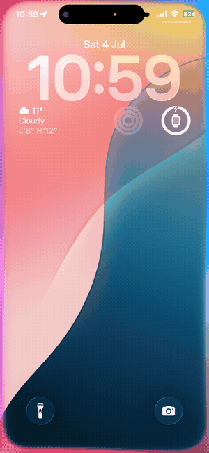
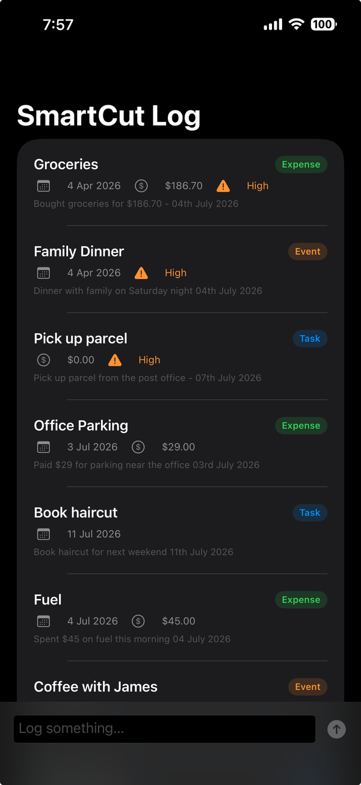
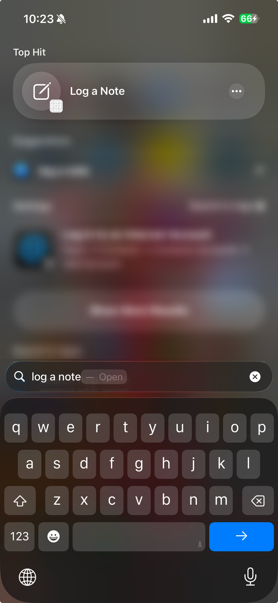
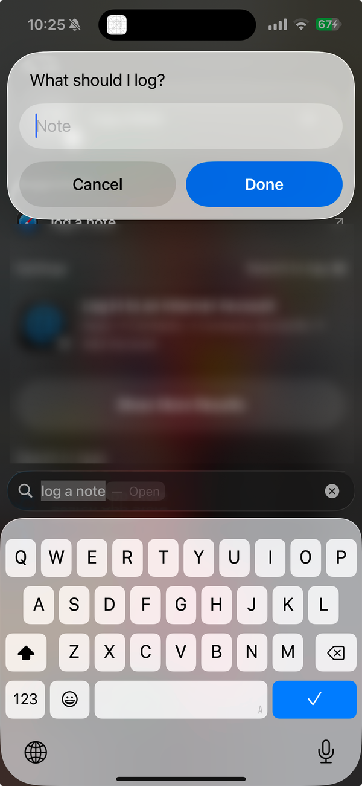
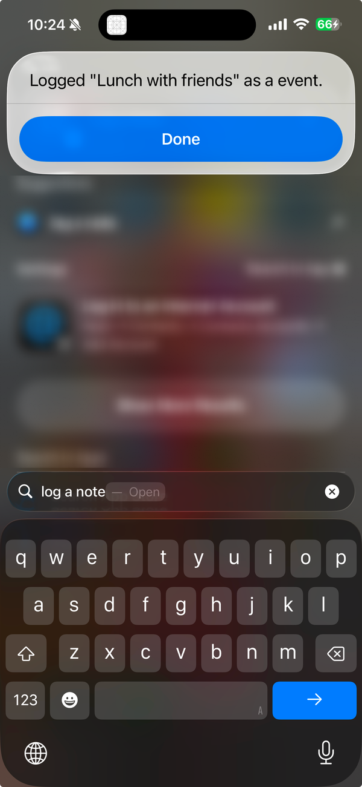

<div align="center">

# SmartCut Log

**One messy sentence in. A clean, structured note out — on-device, and callable by Siri, Spotlight and Shortcuts without opening the app.**


Companion project for **[The 2026 Apple AI Stack · Part 2 — The Invisible Intelligence](https://alexgunasekara.com.au/writing/foundation-models-app-intents)** by [Charith Gunasekara](https://alexgunasekara.com.au).

</div>

## Demo

<div align="center">
  
</div>

*"Hey Siri, add a note to SmartCut Log." The on-device model reads the sentence, saves a structured note, and speaks a reply — the app never opens.*

## Screenshots

<table align="center">
  <tr>
    <td align="center"><br/><sub><b>Your notes</b></sub></td>
    <td align="center"><br/><sub><b>Found in Spotlight</b></sub></td>
    <td align="center"><br/><sub><b>Siri asks</b></sub></td>
    <td align="center"><br/><sub><b>Saved, headless</b></sub></td>
  </tr>
</table>

## What it shows

Two Apple 2026 technologies working together in one small app:

- **Foundation Models** — Apple's on-device LLM. We use guided generation (`@Generable` + `@Guide`) to get typed, structured output from free text, so there is no JSON parsing.
- **App Intents** — the system entry point. A headless `AppIntent` plus `AppShortcutsProvider` lets Siri, Shortcuts and Spotlight run the whole thing in the background.

The idea is the same one used by AI agents: the system calls your App Intent as a tool, the tool calls the model, and the model returns structured data you store.

```
Siri / Shortcuts / Spotlight
        │  "Log 'Review backend docs tomorrow 9am' to SmartCut Log"
        ▼
  LogNoteIntent            App Intent, runs headless (openAppWhenRun = false)
        │  rawText
        ▼
  CaptureService           LanguageModelSession + guided generation
        │
        ▼
  CapturedItem (@Generable)  { category · title · dueDate? · priority · amount? }
        │
        ▼
  LogEntry (@Model, SwiftData)  →  SwiftUI list
        ▲
   spoken reply back to Siri
```

## Requirements

- **Xcode 26** (or later)
- **iOS 26+** on a device that supports Apple Intelligence, with the feature turned on.
  The on-device model usually is not available in the Simulator, so use a real device.

Note: this uses Apple's 2026 frameworks during the beta. API names may change before release. If something does not compile, check it against the current SDK.

## Getting started

```bash
git clone https://github.com/Charith1990/smartcut-log.git
cd smartcut-log
open SmartCutLog.xcodeproj
```
In Xcode: select the **SmartCutLog** target, open **Signing & Capabilities**, pick your team, then run on a supported device.

**Before you build:**

- In **Signing & Capabilities**, set your own **Team**. The repo ships with no team, so you sign with your own account.
- If the **bundle identifier** clashes with another app, change it to something unique, like `com.yourname.SmartCutLog`.
- The app scheme is shared, so it is ready to run right after cloning.

## Try it

1. **In the app** — type a note in the bottom bar (for example `Coffee with the team $18`) and tap send. It becomes a saved, categorized row.
2. **Shortcuts app** — the **Log a Note** action appears on its own. Run it and enter some text.
3. **Siri** — say *"Hey Siri, log a note in SmartCut Log."* Siri asks what to log, the app captures it in the background, and it appears in the list.

Some inputs to try: `Pay electricity bill Friday`, `Idea: a plant-watering reminder app`, `Lunch meeting with Priya next Tuesday 12pm`.

## The files

| File | What it does |
| --- | --- |
| `Models/CapturedItem.swift` | `@Generable` output type — the shape the model fills in |
| `Models/LogEntry.swift` | `@Model` SwiftData record — the saved version |
| `Services/AppModelContainer.swift` | One shared database for the app and the intent |
| `Services/CaptureService.swift` | Availability check, the model call, and the mapping |
| `Intents/LogNoteIntent.swift` | The headless App Intent |
| `Intents/SmartCutShortcuts.swift` | The Siri phrases |
| `SmartCutLogApp.swift` | App entry, injects the shared database |
| `ContentView.swift` | The list and the in-app capture bar |

## The article

Full write-up: **[The 2026 Apple AI Stack · Part 2](https://alexgunasekara.com.au/writing/foundation-models-app-intents)**, part of a 5-part series on Apple's 2026 AI stack at [alexgunasekara.com.au](https://alexgunasekara.com.au).

## License

[MIT](LICENSE) © 2026 Charith Gunasekara
